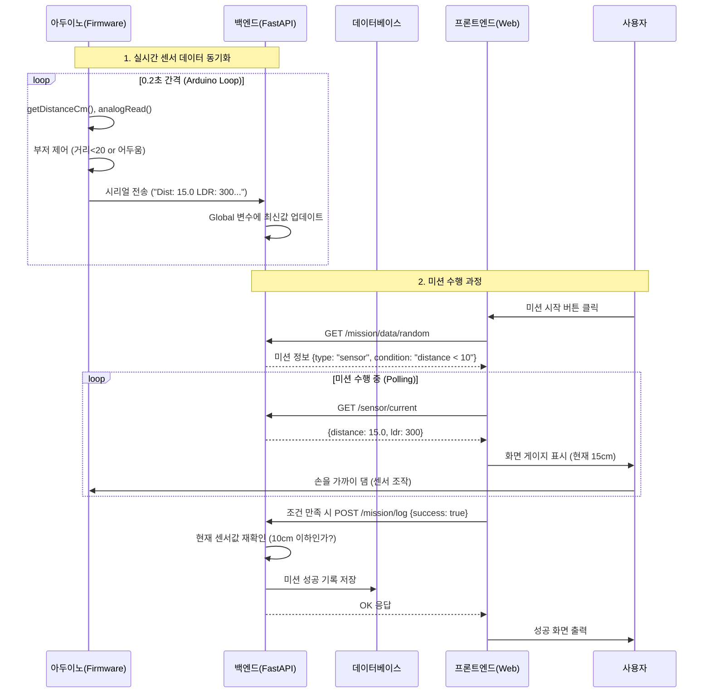

# 기술 문서

## 1. 회로도 및 연결 표

**Tinkercad**에서 그리실 때 참고할 핀 연결표입니다. (아두이노 Uno 기준)

| 부품 (Component) | 아두이노 핀 (Arduino Pin) | 비고 |
| :--- | :--- | :--- |
| **HC-SR04 (초음파 센서)** | | |
| VCC | 5V | |
| GND | GND | |
| Trig | Digital 9 | `TRIG_PIN` (출력) |
| Echo | Digital 8 | `ECHO_PIN` (입력) |
| **LDR (조도 센서)** | | |
| 한쪽 다리 | 5V | |
| 다른쪽 다리 | Analog A0 | `LDR_PIN` (입력), **10kΩ 저항**과 Pull-down 연결 |
| **Piezo Buzzer (부저)** | | |
| (+) | Digital 3 | `BUZZER_PIN` (출력) |
| (-) | GND | |
| **OLED Display (I2C)** | | |
| VCC | 5V | |
| GND | GND | |
| SCL | A5 | (Uno 기준 SCL) |
| SDA | A4 | (Uno 기준 SDA) |

---

## 2. 순서도 (Flowchart)

**Draw.io**에서 그리실 때 사용할 논리 흐름입니다. 아두이노의 내부 동작도 포함되었습니다.

**[시스템 전체 흐름]**

1.  **[시작]**
2.  **[병렬 프로세스 1: 아두이노]**
    *   `setup()`: 핀 모드 설정, 시리얼(9600), OLED 초기화
    *   `loop()` 진입
    *   거리 측정 (`getDistanceCm`) & 조도 측정 (`analogRead`)
    *   조건 검사: (거리 < 20cm) OR (조도 < 150)?
        *   (Yes) -> 부저 ON
        *   (No) -> 부저 OFF
    *   **시리얼 출력**: "Dist: xx LDR: xx..." 전송
    *   OLED 화면 갱신
    *   0.2초 대기
3.  **[병렬 프로세스 2: 웹 서버 & 사용자]**
    *   **[로그인]**: 아이디/비번 입력 -> 인증
    *   **[대시보드]**: 스케줄(알람 시간) 등록
    *   **[스케줄러]**: 매분마다 "현재 시간 == 설정 시간" 체크
        *   (일치) -> **카카오톡 알림 발송**
    *   **[미션 수행]**: 알림 링크 클릭 -> 미션 페이지 접속
    *   **[미션 로직]**:
        *   랜덤 미션 로드 (예: "손을 10cm 이내로!")
        *   웹 화면에서 아두이노 데이터 실시간 조회 (API 호출)
        *   사용자가 센서 조작 -> 화면 게이지 변화
        *   조건 달성 시 -> **[성공]** -> DB 저장
4.  **[종료]**

---

## 3. 시퀀스 다이어그램 (Sequence Diagram)

아두이노와 백엔드, 사용자 간의 데이터 흐름입니다.



---

## 4. 코드 명세표

### 4-1. 아두이노 펌웨어 (`audino.ino`)

#### [전역 변수 및 상수]
| 이름 | 데이터 타입 | 상수(Y/N) | 허용 값 | 설명 |
| :--- | :--- | :---: | :--- | :--- |
| **SCREEN_WIDTH** | define | Y | 128 | OLED 디스플레이 너비 (픽셀) |
| **SCREEN_HEIGHT** | define | Y | 64 | OLED 디스플레이 높이 (픽셀) |
| **display** | Adafruit_SSD1306 | N | 객체 | OLED 제어 인스턴스 |
| **TRIG_PIN** | int | Y | 9 | 초음파 센서 Trigger 핀 |
| **ECHO_PIN** | int | Y | 8 | 초음파 센서 Echo 핀 |
| **LDR_PIN** | int | Y | A0 | 조도 센서 아날로그 입력 핀 |
| **BUZZER_PIN** | int | Y | 3 | 부저 디지털 출력 핀 |

#### [핵심 함수]
| 이름 | 반환 타입 | 매개변수 | 설명 |
| :--- | :--- | :--- | :--- |
| **setup** | void | 없음 | 핀 모드(INPUT/OUTPUT) 설정, Serial(9600) 시작, OLED 초기화 수행. |
| **loop** | void | 없음 | 무한 반복. 센서값 측정 → 부저 제어 → 시리얼 출력 → OLED 갱신 순으로 동작. |
| **getDistanceCm** | float | 없음 | `pulseIn()`을 사용하여 초음파 왕복 시간을 측정하고 거리(cm)로 변환하여 반환. 실패 시 -1 반환. |

---

### 4-2. 백엔드 - 데이터 모델 (Database Models)

`models.py`에 정의된 SQLAlchemy 테이블 구조입니다.

#### [User (사용자 테이블)]
| 이름 | 데이터 타입 | Key | 설명 |
| :--- | :--- | :---: | :--- |
| **id** | Integer | PK | 사용자 고유 ID (Auto Increment) |
| **username** | String | Unique | 로그인 아이디 |
| **hashed_password** | String | - | 암호화된 비밀번호 |

#### [Schedule (알람 스케줄 테이블)]
| 이름 | 데이터 타입 | Key | 설명 |
| :--- | :--- | :---: | :--- |
| **id** | Integer | PK | 스케줄 고유 ID |
| **time_of_day** | String | - | 알람 시간 (Format: "HH:MM") |
| **user_id** | Integer | FK | 소유자(User) ID |
| **is_active** | Boolean | - | 알람 활성화 여부 (기본 True) |

#### [Mission (미션 데이터 테이블)]
| 이름 | 데이터 타입 | Key | 설명 |
| :--- | :--- | :---: | :--- |
| **id** | Integer | PK | 미션 고유 ID |
| **type** | String | - | 미션 타입 ("quiz" 또는 "sensor") |
| **content** | String | - | 퀴즈 내용(JSON) 또는 센서 조건(JSON) |
| **answer** | String | - | 정답 또는 검증 키워드 |

---

### 4-3. 백엔드 - 전역 변수 및 설정

#### [Global Variables (`serial_service.py` 등)]
| 이름 | 데이터 타입 | 상수(Y/N) | 설명 |
| :--- | :--- | :---: | :--- |
| **latest_sensor_data** | Dictionary | N | `{distance: float, ldr: int, is_near: bool, ...}` 형태의 실시간 센서값 저장소 |
| **stop_event** | threading.Event | N | 시리얼 통신 스레드를 안전하게 종료하기 위한 시그널 객체 |
| **settings** | Settings(Class) | Y | `.env` 파일에서 로드한 환경 변수 집합 (DB URL, Serial Port 등) |
| **scheduler** | BackgroundScheduler | Y | APScheduler 인스턴스 (1분마다 알람 체크 작업 실행) |

---

### 4-4. 백엔드 - 주요 함수 및 API

#### [Logic Functions]
| 이름 | 위치 | 매개변수 | 설명 |
| :--- | :--- | :--- | :--- |
| **read_serial_loop** | serial_service.py | 없음 | 별도 스레드에서 아두이노 시리얼 포트를 지속적으로 읽어 `latest_sensor_data`를 갱신함. |
| **parse_arduino_line** | serial_service.py | line (str) | "Dist: 10..." 형태의 문자열을 정규식(Regex)으로 파싱하여 숫자 데이터로 변환. |
| **check_schedules...** | scheduler.py | 없음 | DB에서 현재 시간과 일치하는 스케줄을 조회하고 카카오톡 알림을 트리거함. |
| **send_kakao_message** | kakao_service.py | text, url | 카카오톡 "나에게 보내기" API를 호출하여 알림 메시지 전송. |

#### [API Routers (Endpoints)]
| 메서드 | URL 경로 | 설명 |
| :--- | :--- | :--- |
| **POST** | `/auth/token` | 로그인 및 JWT 액세스 토큰 발급 |
| **GET** | `/sensor/current` | 현재 메모리에 저장된 아두이노 센서값 반환 (프론트엔드 폴링용) |
| **GET** | `/mission/data/random` | DB에서 랜덤한 미션 하나를 선택하여 반환 |
| **POST** | `/mission/log` | 미션 성공 여부 기록. **센서 미션일 경우 서버 측에서 현재 센서값을 재검증(보안).** |
| **GET** | `/schedule/` | 사용자의 등록된 알람 스케줄 목록 조회 |
| **POST** | `/schedule/` | 새로운 알람 스케줄 등록 |

---

## 5. 아두이노 코드 (`audino.ino`)

```cpp
#include <Wire.h>
#include <Adafruit_GFX.h>
#include <Adafruit_SSD1306.h>

// ===== OLED 설정 =====
#define SCREEN_WIDTH 128
#define SCREEN_HEIGHT 64
Adafruit_SSD1306 display(SCREEN_WIDTH, SCREEN_HEIGHT, &Wire, -1); // 리셋핀 없음(-1)

// ===== 핀 설정 =====
const int TRIG_PIN   = 9;   // 초음파 Trig
const int ECHO_PIN   = 8;   // 초음파 Echo
const int LDR_PIN    = A0;  // 조도 센서
const int BUZZER_PIN = 3;   // 능동 부저

// 거리 계산 함수
float getDistanceCm() {
  digitalWrite(TRIG_PIN, LOW);
  delayMicroseconds(2);
  digitalWrite(TRIG_PIN, HIGH);
  delayMicroseconds(10);
  digitalWrite(TRIG_PIN, LOW);

  long duration = pulseIn(ECHO_PIN, HIGH, 30000); // 30ms 타임아웃
  if (duration == 0) {
    return -1; // 측정 실패
  }
  float distance = duration * 0.034 / 2.0; // 소리 속도 이용
  return distance;
}

void setup() {
  Serial.begin(9600);

  pinMode(TRIG_PIN, OUTPUT);
  pinMode(ECHO_PIN, INPUT);
  pinMode(BUZZER_PIN, OUTPUT);
  pinMode(LDR_PIN, INPUT);

  // 부저 꺼두기
  digitalWrite(BUZZER_PIN, LOW);

  // OLED 초기화
  if (!display.begin(SSD1306_SWITCHCAPVCC, 0x3C)) { // 대부분 0x3C, 아니면 0x3D로 바꿔보기
    Serial.println(F("SSD1306 init fail"));
    for (;;); // 여기서 멈춤
  }

  display.clearDisplay();
  display.setTextSize(1);
  display.setTextColor(SSD1306_WHITE);
  display.setCursor(0, 0);
  display.println("Sensor Test Start");
  display.display();
  delay(1000);
}

void loop() {
  // 1) 센서 값 읽기
  float distance = getDistanceCm(); // cm
  int ldrValue = analogRead(LDR_PIN); // 0~1023

  // 2) 조건에 따라 부저 울리기
  bool isNear = (distance < 20);   // 20cm 이내
  bool isDark = (ldrValue < 150);                  // 어두움 기준 예시

  if (isNear || isDark) {
    digitalWrite(BUZZER_PIN, HIGH);
  } else {
    digitalWrite(BUZZER_PIN, LOW);
  }

  // 3) 시리얼 모니터 출력
  Serial.print("Dist(cm): ");
  Serial.print(distance);
  Serial.print("   LDR: ");
  Serial.print(ldrValue);
  Serial.print("   Near: ");
  Serial.print(isNear);
  Serial.print("   Dark: ");
  Serial.println(isDark);

  // 4) OLED에 출력
  display.clearDisplay();
  display.setCursor(0, 0);

  display.print("Dist: ");
  if (distance < 0) {
    display.println("----");
  } else {
    display.print(distance, 1);
    display.println(" cm");
  }

  display.print("LDR : ");
  display.println(ldrValue);

  display.print("Near: ");
  display.println(isNear ? "YES" : "NO");

  display.print("Dark: ");
  display.println(isDark ? "YES" : "NO");

  display.display();

  delay(200); // 0.2초마다 갱신
}
```